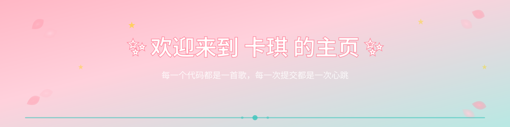
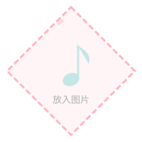

<!--
  🌸 初音未来主题 GitHub Profile
  个人主页 — Kachi5820 / 卡琪
-->

<!-- ==================== Banner ==================== -->

  

<!-- ==================== 菱形图片区 ==================== -->
 

  

    —————— 🎨 初音画廊 · Miku Gallery ——————
  

  

    
    &nbsp;
    
    &nbsp;
    
    &nbsp;
    
    &nbsp;
    
  

  
⬆ 替换为你的初音未来图片 ⬆

 

<!-- ==================== 关于我 ==================== -->
<b>🌸 关于我 · About Me</b>

你好！我是 <b>卡琪</b>

🎓 bg：深大金融科技

务必相信越努力 越幸运◍˃ᵕ˂◍

🎀 🎸 邦多利RAS厨 · 🎵 日音爱好者 · 🎤 Eason/Yoga · 🌱 INFJ

 

<!-- ==================== 信息区 ==================== -->
<b>🛠️ 技能</b>

  
  
  
  
  
  
  

<b>📋 职业规划</b>

开发 | 产品 | 金融科技相关职业

<b>💌 联系方式</b>

  📕 小红书：<a href="https://www.xiaohongshu.com/user/profile/1029985787">卡琪同学请学习</a> &nbsp;·&nbsp; 🅱️ B站：<a href="#">卡琪同学别睡了</a> &nbsp;·&nbsp; 📧 <a href="mailto:1260298305@qq.com">1260298305@qq.com</a>

 

<!-- ==================== 底部 ==================== -->

  

 

  🌸 由 <a href="https://github.com/Kachi5820/miku-github-profile">初音未来主题模板</a> 生成 · 用 ❤️ 和 🎵 制作

